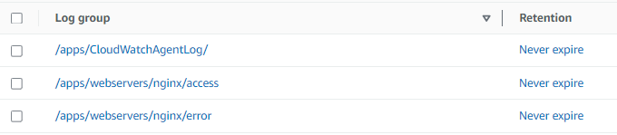

# Send EC2 Logs To CloudWatch
# Test Word for git commands

> **Steps To Follow**

1. Create IAM Role With CloudWatch Log Policy
2. Attach Role To EC2 Instance
3. Install CloudWatch Agent
4. Install Nginx Web Server
5. Configure Json File For CloudWatch
6. Add Necessary Log Location In JSON File.

# Create IAM Role With Custom Policy

- Role Name - AWS-EC2-Log

```

{
  "Version": "2012-10-17",
  "Statement": [
    {
      "Effect": "Allow",
      "Action": [
        "logs:CreateLogGroup",
        "logs:CreateLogStream",
        "logs:PutLogEvents",
        "logs:DescribeLogStreams"
    ],
      "Resource": [
        "arn:aws:logs:*:*:*"
    ]
  }
 ]
}

```

- Attach This Policy To EC2 Instance

- Install CloudWatch Agent On EC2

Ref: https://docs.aws.amazon.com/AmazonCloudWatch/latest/monitoring/verify-CloudWatch-Agent-Package-Signature.html

```

wget https://amazoncloudwatch-agent-ap-south-1.s3.ap-south-1.amazonaws.com/amazon_linux/amd64/latest/amazon-cloudwatch-agent.rpm

rpm -ivh amazon-cloudwatch-agent.rpm

```

- CloudWatch Agent Wizard 

```
sudo /opt/aws/amazon-cloudwatch-agent/bin/amazon-cloudwatch-agent-config-wizard

```

- If You Don't Want To Run CloudWatch Agent Wizard Then Copy Below JSON 

- Default Document Root For CloudWatch Agent - /opt/aws/amazon-cloudwatch-agent

- Goto Location - /opt/aws/amazon-cloudwatch-agent/bin
- Paste Below Content In config.json File

```
{
        "agent": {
          "metrics_collection_interval": 10,
          "run_as_user": "root"
        },
        "logs": {
          "logs_collected": {
                "files": {
                  "collect_list": [
                        {
                          "file_path": "/opt/aws/amazon-cloudwatch-agent/logs/amazon-cloudwatch-agent.log",
                          "log_group_name": "/apps/CloudWatchAgentLog/",
                          "log_stream_name": "{ip_address}_{instance_id}",
                          "timezone": "Local"
                        },
                        {
                          "file_path": "/var/log/messages",
                          "log_group_name": "/apps/system/messages",
                          "log_stream_name": "{ip_address}_{instance_id}",
                          "timestamp_format": "%b %d %H:%M:%S",
                          "timezone": "Local"
                        },
                        {
                          "file_path": "/var/log/nginx/access.log",
                          "log_group_name": "/apps/webservers/nginx/access",
                          "log_stream_name": "{ip_address}_{instance_id}",
                          "timestamp_format": "%d/%b/%Y:%H:%M:%S %z",
                          "timezone": "Local"
                        },
                        {                           
                        "file_path": "/var/log/nginx/error.log",
                        "log_group_name": "/apps/webservers/nginx/error",
                        "log_stream_name": "{ip_address}_{instance_id}",
                         "timestamp_format": "%d/%b/%Y:%H:%M:%S %z",
                        "timezone": "Local"
                        }
                  ]
                }
          }
        },
        "metrics": {
          "aggregation_dimensions": [
                [
                  "InstanceId"
                ]
          ],
          "append_dimensions": {
                "AutoScalingGroupName": "${aws:AutoScalingGroupName}",
                "ImageId": "${aws:ImageId}",
                "InstanceId": "${aws:InstanceId}",
                "InstanceType": "${aws:InstanceType}"
          },
          "metrics_collected": {
                "collectd": {
                  "metrics_aggregation_interval": 60
                },
                "disk": {
                  "measurement": [
                        "used_percent"
                  ],
                  "metrics_collection_interval": 10,
                  "resources": [
                        "*"
                  ]
                },
                "mem": {
                  "measurement": [
                        "mem_used_percent"
                  ],
                  "metrics_collection_interval": 10
                },
                "statsd": {
                  "metrics_aggregation_interval": 60,
                  "metrics_collection_interval": 10,
                  "service_address": ":8125"
                }
          }
        }
  }

```

- Start CloudWatch Agent Service

```
/opt/aws/amazon-cloudwatch-agent/bin/amazon-cloudwatch-agent-ctl -a fetch-config -m ec2 -c file:/opt/aws/amazon-cloudwatch-agent/bin/config.json -s

```

- Check CloudWatch Agent Status

```
/opt/aws/amazon-cloudwatch-agent/bin/amazon-cloudwatch-agent-ctl -a status

```

- Goto AWS CloudWatch and Check Log Group Status


